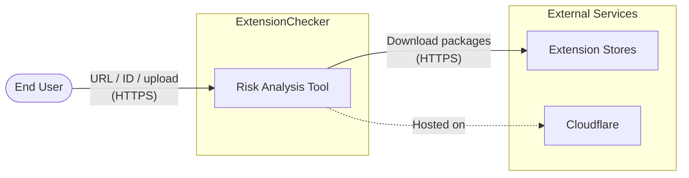
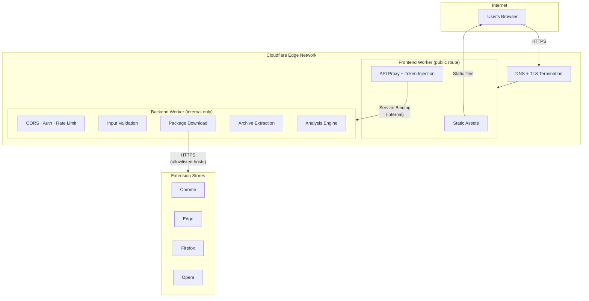
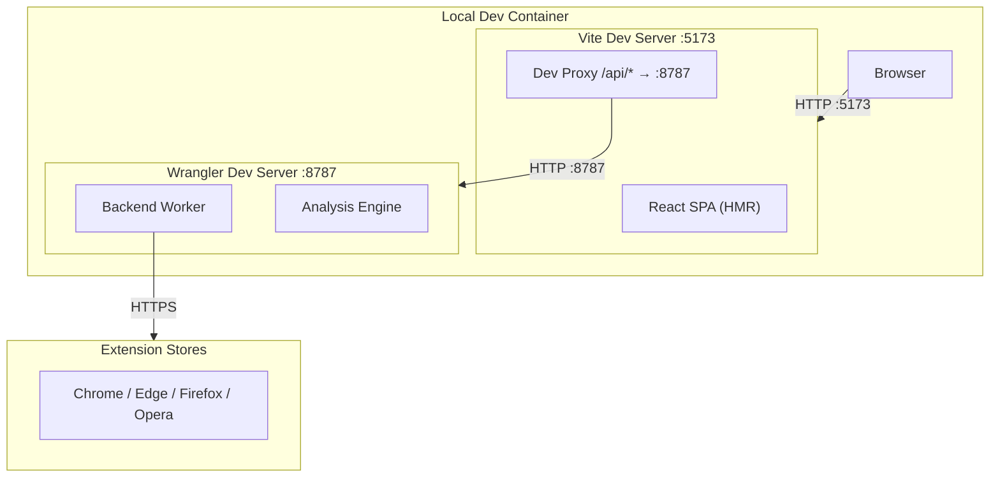
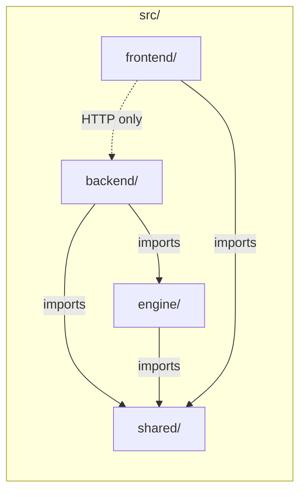

# Architecture Overview

This document describes the high-level architecture of ExtensionChecker for
threat-modeling purposes. It identifies every major component, the runtime
environment each lives in, and the trust boundaries between them.

## System Context

ExtensionChecker is a browser extension risk analysis tool. Users submit an
extension by store URL, extension ID, or file upload and receive a structured,
human-readable risk report. The public deployment runs entirely on Cloudflare
(Pages/Workers). The architecture is also designed for local development and
self-hosting.

## Deployment Architecture (Production)

In production, the entire stack runs on Cloudflare. The **Frontend Worker**
is the only component with a public route. The Backend Worker has no public
URL - it is reachable only via a Cloudflare **service binding** (an internal,
zero-latency call that never traverses the public internet).

## Deployment Architecture (Local Development)

During local development, Vite serves the frontend on `localhost:5173` and
proxies `/api/*` requests to the backend Wrangler dev server on
`localhost:8787`. No Cloudflare account or deployment is required.

## Package Architecture (Monorepo)

All code lives under `src/`. The four packages have strict responsibilities:

| Package | Responsibility | Runtime |
|---------|---------------|---------|
| `src/shared/` | Report schema (Zod), shared types, constants | Imported by all packages |
| `src/engine/` | Manifest parsing, permission analysis, risk scoring | Imported by backend at build time |
| `src/backend/` | HTTP API (Hono), input validation, URL/ID resolution, package download, archive extraction, CORS, auth, rate limiting | Cloudflare Worker (or local Wrangler) |
| `src/frontend/` | React SPA, report rendering, PDF export, theme, file upload UI | Browser (served by CF Pages/Worker) |

## Component Detail

### Frontend Worker

The Frontend Worker is the **only publicly routable** component. It has two
jobs:

1. **Serve static assets** - the built React SPA, CSS, JS, and images.
2. **Proxy API requests** - intercept `/api/*` and `/health`, inject the
   `x-extensionchecker-token` header from its own secret store, and forward
   to the Backend Worker via service binding.

The browser never sees or handles the API access token.

### Backend Worker

The Backend Worker handles all business logic:

- **CORS & origin enforcement** - validates `Origin` header against an
  allowlist.
- **Token authentication** - optional shared-secret check via
  `x-extensionchecker-token`.
- **Rate limiting** - in-memory per-IP and global rate limiter with
  per-minute and per-day windows.
- **Input validation** - Zod schemas for all request bodies.
- **URL safety** - SSRF protection: HTTPS-only, private IP rejection,
  host allowlist.
- **ID resolution** - maps extension IDs to download URL candidates per
  ecosystem.
- **Package download** - fetches extension packages from allowlisted store
  hosts with timeout and size limits.
- **Archive extraction** - selective ZIP decompression (only `manifest.json`
  and `_locales/`) with zip bomb, path traversal, and decompression bomb
  defenses.
- **Analysis** - delegates to the engine for manifest analysis and risk
  scoring.

### Analysis Engine

A pure library with no network or I/O dependencies. It receives a parsed
manifest object and returns a structured risk report. Responsibilities:

- Permission weight scoring (deterministic, configurable weights).
- Dangerous combination detection (e.g., `cookies` + broad host access).
- Content script injection scope analysis.
- Externally connectable surface analysis.
- Risk signal generation with evidence chains.
- Severity classification (critical / high / medium / low).

### Shared Package

Type definitions and Zod schemas shared across all packages:

- `AnalysisReport` - the complete report returned to the frontend.
- `RiskSignal`, `PermissionDetail`, `ManifestMetadata` - sub-schemas.
- Constants for severity levels, permission categories, etc.

## Technology Stack

| Layer | Technology |
|-------|-----------|
| Frontend framework | React 19, TypeScript |
| Frontend build | Vite |
| Backend framework | Hono (lightweight HTTP framework for Workers) |
| Validation | Zod |
| PDF export | jsPDF |
| Markdown rendering | marked + marked-alert |
| Archive handling | fflate (JavaScript ZIP decompression) |
| Testing | Vitest |
| Deployment | Cloudflare Workers + Pages |
| Local dev | VS Code Dev Container, Vite dev server, Wrangler |
