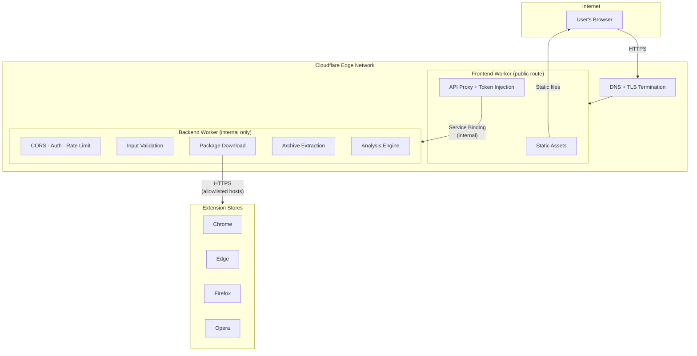
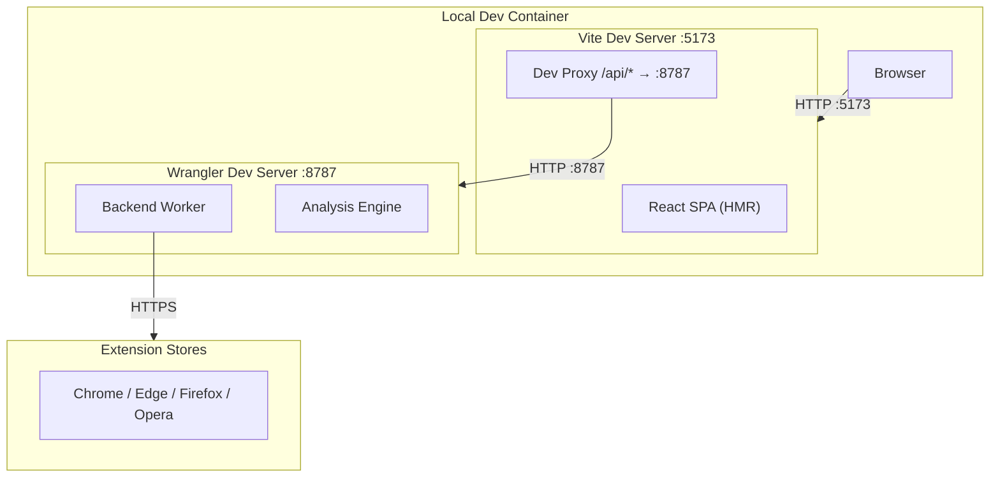
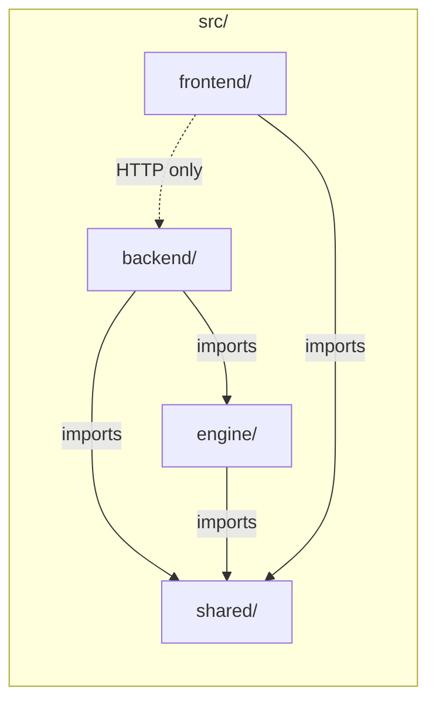

# Architecture Overview

This document describes the high-level architecture of ExtensionChecker for
threat-modeling purposes. It identifies every major component, the runtime
environment each lives in, and the trust boundaries between them.

## System Context

ExtensionChecker is a browser extension risk analysis tool. Users submit an
extension by store URL, extension ID, or file upload and receive a structured,
human-readable risk report. The public deployment runs entirely on Cloudflare
(Pages/Workers). The architecture is also designed for local development and
self-hosting.

## Deployment Architecture (Production)

In production, the entire stack runs on Cloudflare. The **Frontend Worker**
is the only component with a public route. The Backend Worker has no public
URL - it is reachable only via a Cloudflare **service binding** (an internal,
zero-latency call that never traverses the public internet).

## Deployment Architecture (Local Development)

During local development, Vite serves the frontend on `localhost:5173` and
proxies `/api/*` requests to the backend Wrangler dev server on
`localhost:8787`. No Cloudflare account or deployment is required.

## Package Architecture (Monorepo)

All code lives under `src/`. The four packages have strict responsibilities:

| Package | Responsibility | Runtime |
|---------|---------------|---------|
| `src/shared/` | Report schema (Zod), shared types, constants | Imported by all packages |
| `src/engine/` | Manifest parsing, permission analysis, risk scoring | Imported by backend at build time |
| `src/backend/` | HTTP API (Hono), input validation, URL/ID resolution, package download, archive extraction, CORS, auth, rate limiting | Cloudflare Worker (or local Wrangler) |
| `src/frontend/` | React SPA, report rendering, PDF export, theme, file upload UI | Browser (served by CF Pages/Worker) |

## Component Detail

### Frontend Worker

The Frontend Worker is the **only publicly routable** component. It has two
jobs:

1. **Serve static assets** - the built React SPA, CSS, JS, and images.
2. **Proxy API requests** - intercept `/api/*` and `/health`, inject the
   `x-extensionchecker-token` header from its own secret store, and forward
   to the Backend Worker via service binding.

The browser never sees or handles the API access token.

### Backend Worker

The Backend Worker handles all business logic:

- **CORS & origin enforcement** - validates `Origin` header against an
  allowlist.
- **Token authentication** - optional shared-secret check via
  `x-extensionchecker-token`; comparison uses a constant-time XOR function
  to eliminate timing side-channels.
- **Rate limiting** - in-memory per-IP and global rate limiter with
  per-minute and per-day windows; map size capped at 20,000 keys.
- **Input validation** - Zod schemas for all request bodies.
- **URL safety** - SSRF protection: HTTPS-only, full RFC 6890 private IPv4
  rejection (13 ranges including CGNAT, TEST-NETs, benchmark, reserved),
  private IPv6 rejection (including IPv4-mapped `::ffff:*` addresses),
  host allowlist.
- **Post-redirect validation** - after following HTTP redirects, the final
  `response.url` is checked against private-IP and localhost gates to
  prevent SSRF via open redirects on store domains.
- **ID resolution** - maps extension IDs to download URL candidates per
  ecosystem.
- **Package download** - fetches extension packages from allowlisted store
  hosts with timeout and size limits.
- **Archive extraction** - selective ZIP decompression (only `manifest.json`
  and `_locales/`) with zip bomb, path traversal, and decompression bomb
  defenses.
- **Analysis** - delegates to the engine for manifest analysis and risk
  scoring.
- **Security headers** - all API responses include `X-Frame-Options: DENY`,
  `Content-Security-Policy: default-src 'none'; frame-ancestors 'none'`,
  `Strict-Transport-Security` (1-year, includeSubDomains, preload),
  `X-DNS-Prefetch-Control: off`, `X-Permitted-Cross-Domain-Policies: none`,
  and a strict `Permissions-Policy` (including `browsing-topics=()`).
- **Scraper size limits** - HTML scrapers for Chrome, Edge, and Opera enforce
  a 2 MB response size cap (`MAX_HTML_RESPONSE_BYTES`) before parsing to
  prevent memory exhaustion from oversized store pages.
- **Generic error handling** - the global `app.onError` handler returns a
  fixed `"Internal server error."` message; raw `error.message` is never
  forwarded to clients.

**Backend source modules** (`src/backend/src/`):

| Module | Responsibility |
|--------|---------------|
| `app.ts` | Factory: creates the Hono app, wires middleware, delegates to route registrars |
| `route-analyze.ts` | `POST /api/analyze` handler (URL + ID sources, JSON + SSE) |
| `route-upload.ts` | `POST /api/analyze/upload` handler (multipart file upload, JSON + SSE) |
| `route-deps.ts` | `RouteDeps` type injected into route registrars |
| `middleware.ts` | Security-header middleware, API auth/rate-limit middleware, `wantsEventStream` |
| `security.ts` | Request-level validation: origin/CORS, client IP, content-type, constant-time token check |
| `security-config.ts` | `BackendSecurityEnv`, `SecurityConfig` types; env parsers and config builders |
| `rate-limiter.ts` | `InMemoryRateLimiter` class; tumbling-window per-IP and global counters |
| `url-safety.ts` | `validatePublicFetchUrl`, `validateRedirectDestination`, private-IP helpers |
| `archive.ts` | ZIP/CRX/XPI extraction with full adversarial-archive validation |
| `download.ts` | `downloadPackage`, `resolveAndDownloadExtensionId`, extension helpers |
| `id-resolution.ts` | Maps ecosystem-prefixed IDs to download URL candidates |
| `listing-url.ts` | Extracts extension identifiers from store listing URLs |
| `report.ts` | Builds `AnalysisReport` from manifest + store data |
| `schemas.ts` | Zod schemas for API request and manifest types |
| `constants.ts` | Shared numeric constants (size limits, extension lists) |
| `store-metadata.ts` | Assembles store metadata from scraper results |
| `scrapers/` | Per-store HTML scrapers (Chrome, Edge, Opera) + KV caching |
| `worker.ts` | Cloudflare Worker entry point |

### Analysis Engine

A pure library with no network or I/O dependencies. It receives a parsed
manifest object and returns a structured risk report. Responsibilities:

- Permission weight scoring (deterministic, configurable weights).
- Dangerous combination detection (e.g., `cookies` + broad host access).
- Content script injection scope analysis.
- Externally connectable surface analysis.
- Risk signal generation with evidence chains.
- Severity classification (critical / high / medium / low).

### Shared Package

Type definitions and Zod schemas shared across all packages:

- `AnalysisReport` - the complete report returned to the frontend.
- `RiskSignal`, `PermissionDetail`, `ManifestMetadata` - sub-schemas.
- Constants for severity levels, permission categories, etc.

## Technology Stack

| Layer | Technology |
|-------|-----------|
| Frontend framework | React 19, TypeScript |
| Frontend build | Vite |
| Backend framework | Hono (lightweight HTTP framework for Workers) |
| Validation | Zod |
| PDF export | jsPDF |
| Markdown rendering | marked + marked-alert |
| Archive handling | fflate (JavaScript ZIP decompression) |
| Testing | Vitest |
| Deployment | Cloudflare Workers + Pages |
| Local dev | VS Code Dev Container, Vite dev server, Wrangler |
