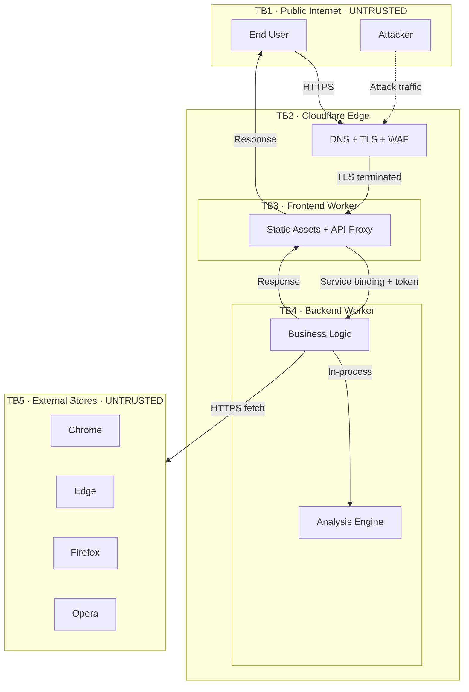
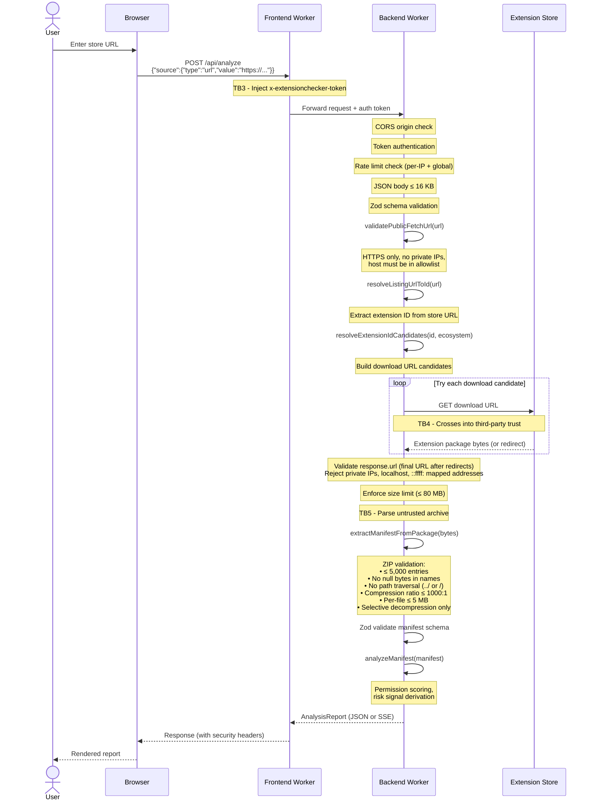
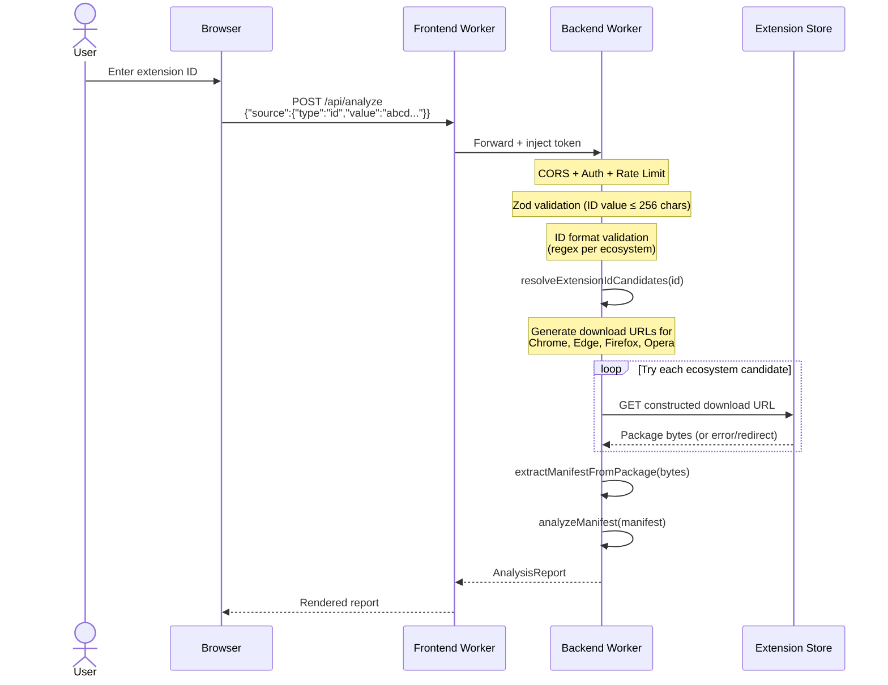
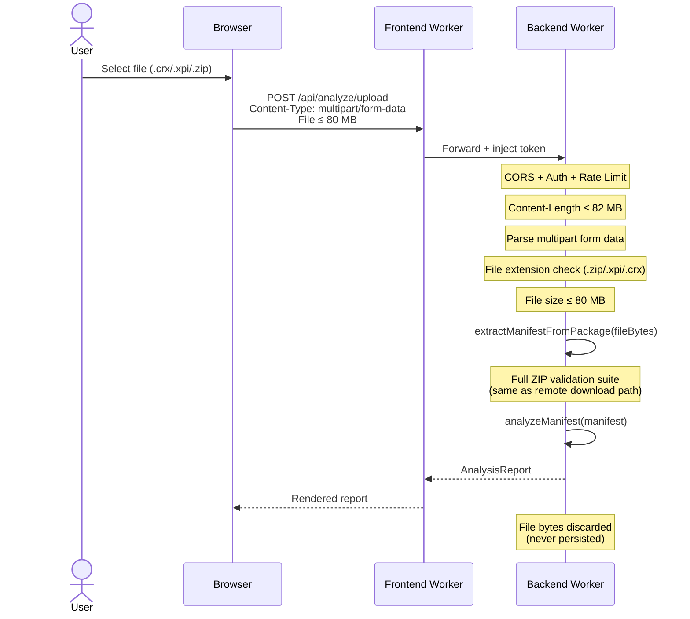
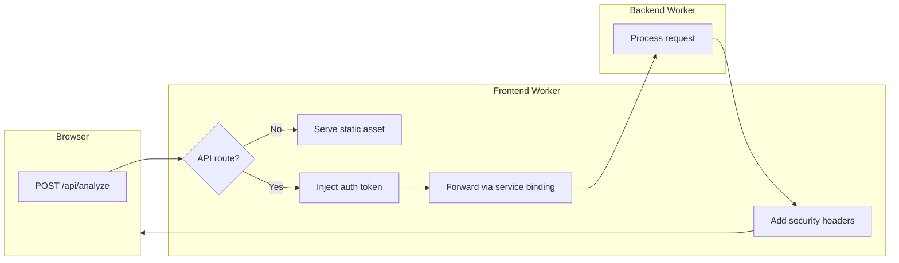
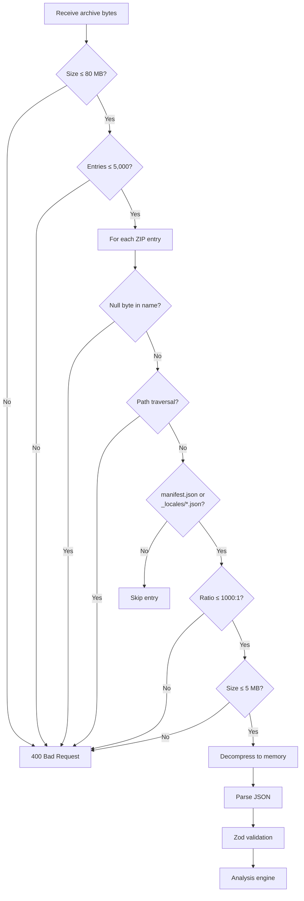
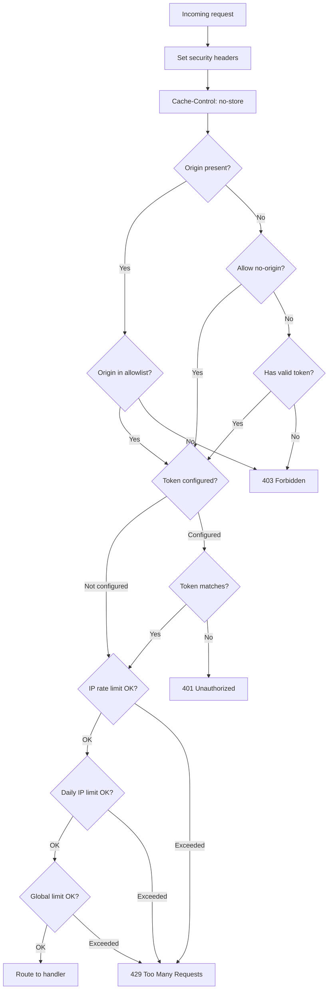

# Data Flows & Trust Boundaries

This document maps every significant data flow through ExtensionChecker and
identifies the trust boundaries that data crosses. Each boundary represents a
point where the system's trust assumptions change and where security controls
must be enforced.

---

## Trust Boundary Map

### Trust Boundary Definitions

| ID | Boundary | Trust Level | What Crosses It |
|----|----------|-------------|-----------------|
| TB1 | Public Internet → Cloudflare Edge | **Untrusted → Platform** | All user HTTP requests, attacker traffic |
| TB2 | Cloudflare Edge → Frontend Worker | **Platform → App** | TLS-terminated requests, Cloudflare-injected headers (`cf-connecting-ip`) |
| TB3 | Frontend Worker → Backend Worker | **App → App (elevated)** | Proxied API requests with injected auth token |
| TB4 | Backend Worker → External Stores | **App → Third-party** | HTTPS fetches for extension packages; response content AND redirect destinations are **untrusted** |
| TB5 | External Package → Archive Extractor | **Untrusted content → Parser** | ZIP archive bytes - most critical attack surface |

---

## Data Flow 1: URL Submission

User provides a full extension store URL (e.g.,
`https://chromewebstore.google.com/detail/extension-name/abcdefghijklmnop`).

---

## Data Flow 2: Extension ID Submission

User provides only an extension identifier (e.g., `abcdefghijklmnopabcdefghijklmnop`).

---

## Data Flow 3: File Upload

User uploads a local `.crx`, `.xpi`, or `.zip` file directly.

---

## Data Flow 4: Frontend Worker API Proxy

Detail of how the Frontend Worker mediates between the browser and backend.

---

## Data Flow 5: Archive Extraction Pipeline

This is the most security-critical data flow. Untrusted archive bytes from
a user upload or remote download are parsed and selectively decompressed.

---

## Data Flow 6: Security Control Chain (Backend)

Every API request passes through this ordered chain of security controls
before any business logic executes. Token comparison uses a constant-time
XOR-over-padded-buffers function to prevent timing side-channel attacks.
Security headers applied to every response include `X-Frame-Options: DENY`,
`Content-Security-Policy: default-src 'none'; frame-ancestors 'none'`,
`Strict-Transport-Security` (1-year, includeSubDomains, preload),
`X-Content-Type-Options: nosniff`, `Referrer-Policy: no-referrer`,
`X-DNS-Prefetch-Control: off`, `X-Permitted-Cross-Domain-Policies: none`,
and a strict `Permissions-Policy` (including `browsing-topics=()`).

---

## Data at Rest & In Transit

| Data | At Rest | In Transit | Retention |
|------|---------|-----------|-----------|
| Uploaded extension packages | **Never persisted** - processed in Worker memory only | HTTPS (user → CF edge → Worker) | Discarded after response |
| Downloaded extension packages | **Never persisted** - held in memory during analysis | HTTPS (store → Worker) | Discarded after response |
| Analysis reports | **Not stored** (v0.1.0) - returned in HTTP response | HTTPS (Worker → CF edge → user) | None server-side; client may save |
| API access token | Cloudflare encrypted secret store | Injected in internal service binding header | Persistent (until rotated) |
| Rate limit counters | Worker in-memory (per isolate) | N/A | Reset on Worker restart |
| User theme preference | Browser localStorage | Never transmitted | Until user clears storage |
| Server logs (IP, timestamp, path) | Cloudflare infrastructure logs | Internal | Limited retention period |

---

## Sensitive Data Inventory

| Data Element | Classification | Handled By | Protection |
|-------------|---------------|-----------|------------|
| User IP address | PII (operational) | Rate limiter, CF logs | Not persisted in app; used transiently |
| API access token | Secret | Frontend Worker env, Backend Worker env | CF encrypted secrets; never exposed to browser |
| Extension package bytes | Untrusted input | Backend archive extractor | Full validation suite; memory-only processing |
| Manifest JSON | Untrusted input (parsed) | Backend + Engine | Zod schema validation before use |
| Store URLs | User input | Backend URL validator | SSRF protection: HTTPS, allowlist, no private IPs |
| Extension IDs | User input | Backend ID resolver | Format validation (regex per ecosystem) |
