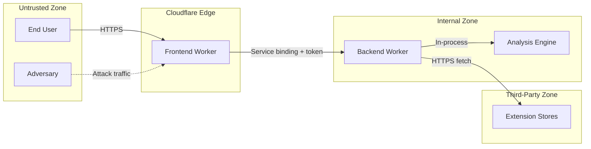
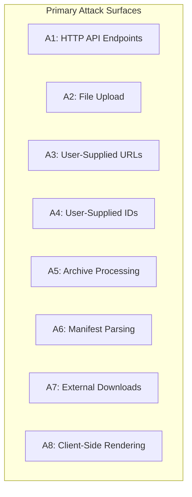
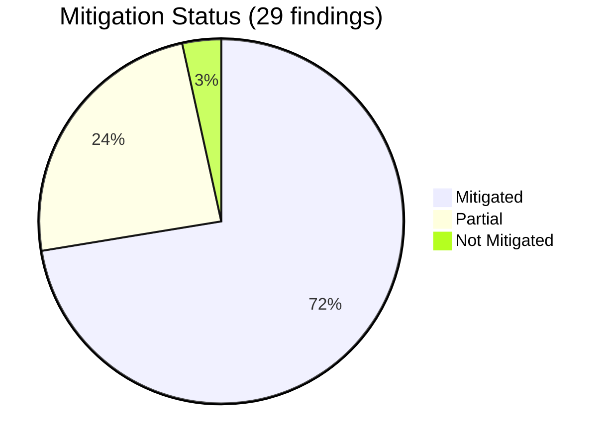

# Threat Model — ExtensionChecker

This threat model uses the **Four Questions Framework** (Adam Shostack) to
systematically identify threats to ExtensionChecker. Findings are classified
using **STRIDE** and each is assessed for current mitigation status.

> **Companion documents:**
> - [ARCHITECTURE.md](ARCHITECTURE.md) — component overview and deployment diagrams
> - [DATA_FLOWS.md](DATA_FLOWS.md) — data flows, trust boundaries, and sensitive data inventory

---

## The Four Questions

### 1. What are we working on?

ExtensionChecker is a browser extension risk analysis tool. Users submit
extensions via store URL, extension ID, or file upload. The backend downloads
or receives the package, extracts the manifest from the archive, runs a
deterministic risk analysis, and returns a structured report to the frontend.

**Key assets to protect:**

| Asset | Value | Impact if Compromised |
|-------|-------|----------------------|
| Backend Worker availability | Core service | Denial of service for all users |
| Integrity of analysis reports | User trust | Users make wrong security decisions based on falsified reports |
| User IP addresses (in logs) | PII | Privacy violation |
| API access token | Authn secret | Unauthorized API access, abuse |
| Backend Worker resources (CPU, memory) | Operational | Resource exhaustion, cost escalation |
| Extension package bytes (in transit) | Confidentiality | Exposure of unpublished extension code |
| External store credentials/access | Availability | Loss of package download capability |

**Deployment model:**

### 2. What can go wrong?

Threats are enumerated below using STRIDE across each trust boundary and
component. See the [STRIDE Findings Table](#stride-findings-table) for the
full catalog.

### 3. What are we going to do about it?

Each finding in the table includes its current mitigation status. Items marked
**Mitigated** have implemented controls. Items marked **Partial** have some
controls but residual risk remains. Items marked **Not Mitigated** are
accepted risks or require future work.

### 4. Did we do a good enough job?

This section identifies residual risks and recommended improvements at the end
of this document. The threat model should be re-evaluated when:

- New input types are added (e.g., CLI submission, API v2).
- Caching or persistence is introduced.
- User accounts or saved histories are added.
- New external service integrations are introduced.
- The deployment model changes (e.g., non-Cloudflare hosting).

---

## Attack Surface Summary

---

## STRIDE Findings Table

### Legend

| Status | Meaning |
|--------|---------|
| ✅ Mitigated | Adequate controls implemented |
| ⚠️ Partial | Some controls exist; residual risk remains |
| ❌ Not Mitigated | No controls or accepted risk |

---

### Spoofing

| ID | Threat | Attack Surface | Description | Controls in Place | Status |
|----|--------|---------------|-------------|-------------------|--------|
| S-1 | Spoofed Origin header | A1: API endpoints | Attacker sends forged `Origin` header to bypass CORS checks. | Origin validated server-side against allowlist; `Access-Control-Allow-Origin` set only for matched origins. In production, requests route through Cloudflare edge. | ✅ Mitigated |
| S-2 | Spoofed IP for rate limit bypass | A1: API endpoints | Attacker spoofs `X-Forwarded-For` or `cf-connecting-ip` to evade per-IP rate limits. | `cf-connecting-ip` set by Cloudflare edge and cannot be spoofed by clients; `X-Forwarded-For` used only as fallback; IP format validated (length 2–64, valid IPv4/IPv6 format). | ⚠️ Partial |
| S-3 | Token theft / reuse | A1: API endpoints | API access token intercepted and reused by attacker. | Token transmitted only over HTTPS; injected by Frontend Worker via service binding (never exposed to browser); `Referrer-Policy: no-referrer` prevents leakage. | ✅ Mitigated |
| S-4 | Impersonation of extension store | A7: External downloads | Attacker causes backend to download from a malicious server impersonating a store. | HTTPS-only; host allowlist restricting downloads to known store domains; URL validation rejects non-allowlisted hosts. | ✅ Mitigated |
| S-5 | Spoofed analysis report | A8: Frontend | Attacker intercepts and modifies the analysis report in transit. | HTTPS end-to-end; HSTS enforced (1-year max-age); `Cross-Origin-Resource-Policy: same-origin`. | ✅ Mitigated |

---

### Tampering

| ID | Threat | Attack Surface | Description | Controls in Place | Status |
|----|--------|---------------|-------------|-------------------|--------|
| T-1 | Malicious manifest content | A6: Manifest parsing | Crafted manifest with extreme or unexpected field values to influence scoring or cause errors. | Zod schema validation with strict types; `manifest_version` restricted to integer 2–3; `name`/`version` require min 1 char; unknown fields passed through but not used in scoring. | ✅ Mitigated |
| T-2 | Tampered package from store | A7: External downloads | Man-in-the-middle modifies package bytes between store and backend. | HTTPS-only for all external fetches; TLS certificate validation by Cloudflare runtime. | ✅ Mitigated |
| T-3 | Tampered request body | A1: API endpoints | Attacker modifies JSON body to inject unexpected fields or values. | Zod schema validation (`AnalyzeRequestSchema`) strips/rejects unknown fields; body size limit (16 KB for JSON, 82 MB for upload). | ✅ Mitigated |
| T-4 | Archive with malicious filenames | A5: Archive processing | ZIP entries with path traversal (`../`) or null bytes to confuse parsers. | Null byte rejection; path traversal rejection (`../` and leading `/`); no disk writes (memory-only extraction). | ✅ Mitigated |
| T-5 | Localization injection | A5: Archive processing | Crafted `_locales/` files that return malicious strings for manifest name resolution. | Locale values are treated as display strings only; React auto-escapes all rendered text; no `dangerouslySetInnerHTML` usage in report display. | ✅ Mitigated |
| T-6 | Supply chain — compromised npm dependency | Build pipeline | Malicious code injected via a compromised transitive dependency (e.g., fflate, marked, jsPDF). | No runtime dependency pinning or SRI for bundled libs; standard npm lockfile used. | ⚠️ Partial |

---

### Repudiation

| ID | Threat | Attack Surface | Description | Controls in Place | Status |
|----|--------|---------------|-------------|-------------------|--------|
| R-1 | Untraceable abuse of public API | A1: API endpoints | Attacker abuses the API and no audit trail links actions to source. | Standard Cloudflare server logs capture IP, timestamp, request path, status code; rate limit headers expose per-IP counters. | ⚠️ Partial |
| R-2 | No request-level audit logging | A1: API endpoints | Individual analysis requests are not logged with identifiers for forensic review. | No application-level structured audit log; only platform-level server logs. No request IDs or correlation tokens. | ❌ Not Mitigated |
| R-3 | Rate limit counter reset on Worker restart | A1: API endpoints | In-memory rate limiter resets if Worker isolate is recycled, allowing burst abuse post-restart. | In-memory counters only; no persistent rate limit state. Cloudflare may recycle isolates unpredictably. | ⚠️ Partial |

---

### Information Disclosure

| ID | Threat | Attack Surface | Description | Controls in Place | Status |
|----|--------|---------------|-------------|-------------------|--------|
| I-1 | Verbose error messages leak internals | A1: API endpoints | Stack traces, internal paths, or library versions exposed in error responses. | Error responses use generic messages (`"manifest.json is missing..."`, `"Failed to download..."`); no stack traces in production responses. | ✅ Mitigated |
| I-2 | Timing side-channel on token validation | A1: API endpoints | Token comparison using `===` leaks token length/content through response timing differences. | Token compared with `===` (not constant-time). Low practical risk over network, but theoretically exploitable. | ⚠️ Partial |
| I-3 | IP address exposure in rate limit headers | A1: API endpoints | Rate limit response headers (`x-ratelimit-remaining-*`) confirm the server's view of the client's IP. | Headers expose counter state but not the raw IP itself; IP is already known to the client. Minimal additional disclosure. | ✅ Mitigated |
| I-4 | Extension package content exposure | A5: Archive processing | Full extension package held in Worker memory could leak through memory safety bugs. | Cloudflare Workers use V8 isolates (memory-safe); no disk writes; package bytes discarded after analysis. | ✅ Mitigated |
| I-5 | Server version/technology fingerprinting | A1: API endpoints | Response headers or error messages reveal technology stack. | No `Server` header set; no version info in responses. `X-Content-Type-Options: nosniff` prevents MIME sniffing. | ✅ Mitigated |
| I-6 | Report data exposed to third-party JS libraries | A8: Frontend | jsPDF and marked libraries process report data; if compromised, they could exfiltrate. | Libraries loaded from npm bundle (not CDN); CSP not yet implemented; jsPDF operates on data already shown to user. | ⚠️ Partial |

---

### Denial of Service

| ID | Threat | Attack Surface | Description | Controls in Place | Status |
|----|--------|---------------|-------------|-------------------|--------|
| D-1 | Zip bomb — entry count explosion | A5: Archive processing | ZIP with thousands of entries to exhaust central directory parsing. | Hard limit: max 5,000 entries; rejected before any decompression. | ✅ Mitigated |
| D-2 | Zip bomb — compression ratio | A5: Archive processing | Highly compressed file that expands to enormous size when decompressed. | Compression ratio limit (1000:1) checked from ZIP headers before decompression; per-file limit 5 MB uncompressed. | ✅ Mitigated |
| D-3 | Oversized upload | A2: File upload | Attacker uploads maximum-size files repeatedly to consume bandwidth and Worker CPU. | 80 MB file size limit; `Content-Length` checked before body read (82 MB with overhead); rate limiting per-IP (30/min, 2000/day). | ✅ Mitigated |
| D-4 | Oversized remote package | A7: External downloads | Store returns an unexpectedly large package to exhaust Worker memory. | 80 MB size limit enforced; `Content-Length` header checked before download where available; `AbortSignal.timeout()` enforced (default 30s). | ✅ Mitigated |
| D-5 | Slowloris / slow-read on external fetch | A7: External downloads | A malicious or slow external store sends bytes slowly to hold Worker connections. | `AbortSignal.timeout()` on fetch (default 30s configurable via `API_UPSTREAM_TIMEOUT_MS`). | ✅ Mitigated |
| D-6 | Rate limit bypass via distributed IPs | A1: API endpoints | Attacker uses botnet/proxy network to distribute requests across many IPs. | Per-IP limits + global daily limit (90,000/day). Global limit provides a ceiling even with distributed sources. | ⚠️ Partial |
| D-7 | Rate limiter memory exhaustion | A1: API endpoints | Attacker floods from millions of unique IPs to grow the in-memory rate limit map. | IP key length validated (2–64 chars); map entries expire with time windows; new IPs beyond the 20,000-key cap are collapsed to a single `'overflow'` bucket so the map never grows unboundedly. | ✅ Mitigated |
| D-8 | ReDoS in input parsing | A3: URLs, A4: IDs | Crafted input triggers catastrophic backtracking in regex. | URL parsing uses standard `new URL()` API (not regex); ID validation uses simple non-backtracking regexes (`/^[a-p]{32}$/`). | ✅ Mitigated |
| D-9 | CPU exhaustion via complex manifest | A6: Manifest parsing | Manifest with extremely large permission arrays or deeply nested structures. | Zod schema enforces array-of-strings for permissions; JSON body capped at 16 KB for /api/analyze; manifest.json capped at 5 MB (from archive). | ✅ Mitigated |

---

### Elevation of Privilege

| ID | Threat | Attack Surface | Description | Controls in Place | Status |
|----|--------|---------------|-------------|-------------------|--------|
| E-1 | SSRF via user-supplied URL | A3: User-supplied URLs | Attacker provides a URL pointing to internal services, cloud metadata, or private networks. | `validatePublicFetchUrl()`: HTTPS-only; reject localhost, `.local`, private IPv4 (10/8, 127/8, 169.254/16, 172.16/12, 192.168/16), private IPv6 (::1, fc00::/7, fe80::/10); strict host allowlist. | ✅ Mitigated |
| E-2 | SSRF via DNS rebinding | A3: User-supplied URLs | URL resolves to public IP initially, then re-resolves to internal IP during fetch. | URL validated before fetch; host must be in the allowlist (store-specific domains only); Cloudflare Workers resolve DNS at the platform level. | ✅ Mitigated |
| E-3 | SSRF via HTTP redirect from store | A7: External downloads | Store returns a 3xx redirect to an internal or unauthorized URL. | Cloudflare `fetch()` follows redirects by default. No explicit post-redirect URL re-validation. **Residual risk**: a compromised store could redirect to an arbitrary URL. | ⚠️ Partial |
| E-4 | Prototype pollution via JSON.parse | A6: Manifest parsing | Crafted JSON with `__proto__` keys to pollute Object prototype. | Zod schema explicitly defines expected keys; `passthrough()` on unknown keys but values are not spread onto objects. V8 has hardened `JSON.parse` against prototype pollution. | ✅ Mitigated |
| E-5 | Code injection via manifest values | A6: Manifest parsing | Manifest fields containing `<script>` tags or event handlers rendered in the frontend. | React auto-escapes all interpolated values; no `dangerouslySetInnerHTML`; PDF generation uses jsPDF text methods (not HTML injection). | ✅ Mitigated |
| E-6 | Unauthorized backend access (no token) | A1: API endpoints | Direct requests to backend Worker bypassing the Frontend Worker and its token injection. | Backend has no public route in production; reachable only via Cloudflare service binding from Frontend Worker. API token check enforced when configured. | ✅ Mitigated |
| E-7 | Extension ID injection into download URL | A4: Extension IDs | Crafted ID value injects path segments or query parameters into constructed download URLs. | Chrome/Edge IDs validated against `/^[a-p]{32}$/`; Firefox/Opera IDs passed through `encodeURIComponent()`; download URL templates use string interpolation with encoded values. | ✅ Mitigated |

---

## STRIDE Findings Summary

| Category | Total | ✅ Mitigated | ⚠️ Partial | ❌ Not Mitigated |
|----------|-------|-------------|-----------|------------------|
| **Spoofing** | 5 | 4 | 1 | 0 |
| **Tampering** | 6 | 5 | 1 | 0 |
| **Repudiation** | 3 | 0 | 2 | 1 |
| **Information Disclosure** | 6 | 4 | 2 | 0 |
| **Denial of Service** | 9 | 7 | 2 | 0 |
| **Elevation of Privilege** | 7 | 6 | 1 | 0 |
| **Total** | **29** | **21** | **7** | **1** |

---

## Residual Risks & Recommendations

### High Priority

| ID | Finding | Recommendation |
|----|---------|----------------|
| R-2 | No structured audit logging | Implement application-level request logging with correlation IDs for forensic review. Consider Cloudflare Logpush or Workers Analytics Engine. |
| E-3 | SSRF via redirect from store | Re-validate the final URL after redirect resolution. Reject responses whose final URL does not match the allowlisted host. |
| T-6 | npm supply chain risk | Adopt `npm audit` in CI; consider lockfile review on dependency updates; evaluate Subresource Integrity or bundler hash verification for critical libs (fflate, marked, jsPDF). |

### Medium Priority

| ID | Finding | Recommendation |
|----|---------|----------------|
| S-2 | IP spoofing for rate limits | In non-Cloudflare deployments, `cf-connecting-ip` is unavailable. Document that self-hosters behind reverse proxies must configure trusted proxy headers. |
| D-6 | Distributed rate limit bypass | Consider Cloudflare Rate Limiting (platform feature) or Durable Objects for persistent, distributed rate limit state. |
| R-3 | Rate limit reset on restart | Migrate to persistent rate limiting (Cloudflare Durable Objects or KV) when operational hardening is prioritized. |
| I-2 | Timing side-channel on token | Replace `===` with a constant-time comparison function for token validation. |
| I-6 | Third-party JS library exfiltration | Implement a `Content-Security-Policy` header to restrict script sources, `connect-src`, and `default-src`. |

### Low Priority / Accepted Risk

| ID | Finding | Rationale for Acceptance |
|----|---------|------------------------|
| R-1 | Limited audit trail | Platform-level Cloudflare logs provide basic operational visibility. Acceptable for v0.1.0 with no user accounts or stored data. |

---

## Threat Model Diagram — Full View

```mermaid
graph TB
    subgraph ThreatActors["Threat Actors"]
        CasualUser["Casual User"]
        Researcher["Security Researcher"]
        Abuser["API Abuser"]
        Attacker["Sophisticated Attacker"]
        SupplyChain["Supply Chain Attacker"]
    end

    subgraph Surfaces["Attack Surfaces"]
        API["API Endpoints"]
        Upload["File Upload"]
        URLInput["URL Input"]
        IDInput["ID Input"]
        Archive["Archive Processing"]
        Manifest["Manifest Parsing"]
        ExtFetch["External Fetch"]
        ClientSide["Client-Side Rendering"]
        BuildPipe["Build Pipeline"]
    end

    subgraph Controls["Security Controls"]
        CORS["CORS + Origin Check"]
        Token["Token Auth"]
        RateLimit["Rate Limiter"]
        URLVal["URL Validator"]
        IDVal["ID Validator"]
        ZIPVal["ZIP Validation"]
        ZodVal["Zod Schema"]
        SizeLimit["Size Limits"]
        SecHeaders["Security Headers"]
        HTTPS["HTTPS Only"]
        Allowlist["Host Allowlist"]
        ReactEscape["React Auto-Escape"]
    end

    CasualUser --> API
    Researcher --> API
    Abuser --> API
    Attacker --> URLInput & Upload & Archive & ExtFetch
    SupplyChain --> BuildPipe

    API --> CORS & Token & RateLimit & SizeLimit
    Upload --> SizeLimit & ZIPVal
    URLInput --> URLVal & HTTPS & Allowlist
    IDInput --> IDVal
    Archive --> ZIPVal
    Manifest --> ZodVal
    ExtFetch --> HTTPS & Allowlist
    ClientSide --> ReactEscape & SecHeaders
    BuildPipe -.->|"Partial"| Controls
```

---

## Review Schedule

This threat model should be reviewed:

- **On every major feature addition** (new input types, caching, user accounts).
- **On architectural changes** (new deployment targets, new external integrations).
- **Quarterly** as a standing security hygiene practice.
- **After any security incident** involving the application.

---

_Last reviewed: 2026-03-14_
_Version: 1.0_
_Scope: ExtensionChecker v0.1.0 — manifest-first analysis, no persistence, no user accounts_
